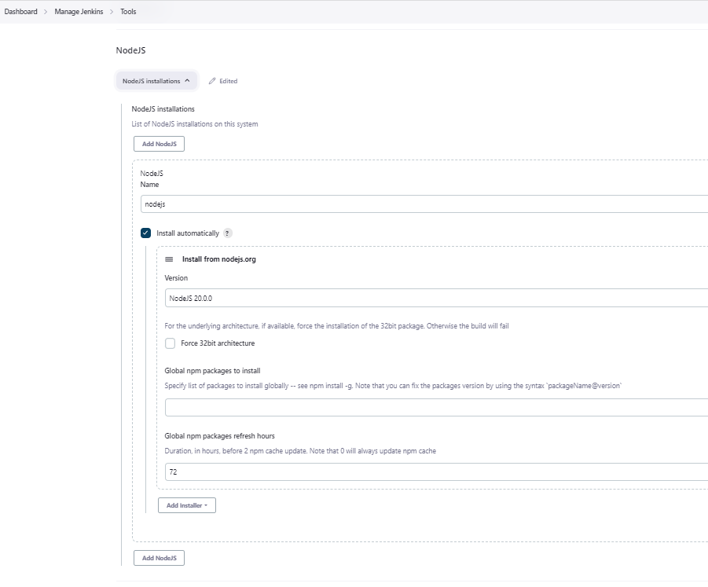
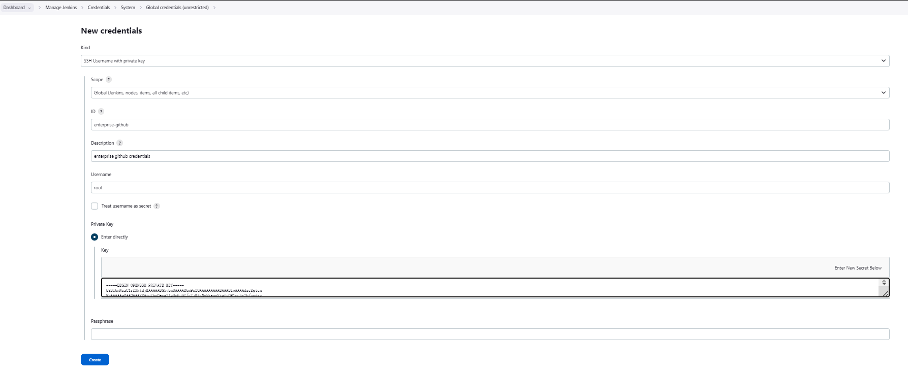

# `Docker` 使用 `Debian` 安装 `Jenkins`
``` shell
# 启动 Debian
 docker run --name jenkins -it -p 8080:8080 debian:latest /bin/bash
# 进入容器
docker exec -it jenkins /bin/bash
# 准备工作
# 1. 安装 java
apt install default-jdk
# 安装 curl
apt-get update -y && apt-get install curl -y
# 安装最新版 https://pkg.jenkins.io/debian/
curl -fsSL https://pkg.jenkins.io/debian/jenkins.io-2023.key | tee \
    /usr/share/keyrings/jenkins-keyring.asc > /dev/null

echo deb [signed-by=/usr/share/keyrings/jenkins-keyring.asc] \
    https://pkg.jenkins.io/debian binary/ | tee \
    /etc/apt/sources.list.d/jenkins.list > /dev/null

apt-get update
apt-get install fontconfig openjdk-11-jre
apt-get install jenkins

# 启动 Jenkins
service jenkins start
# 或者 /etc/init.d/jenkins start
```
## 浏览器中Jenkins启动/重启/停止命令
+ [linux中Jenkins启动/重启/停止命令](https://blog.csdn.net/iamcodingmylife/article/details/88124906)
### 登录
``` powershell
http://localhost:8080/
```
### 关闭Jenkins
``` powershell
http://localhost:8080/exit 
```
### 重启Jenkies
``` powershell
http://localhost:8080/restart 
```
### 重新加载配置信息
``` powershell
http://localhost:8080/reload 
```
[安装 Jenkins](https://www.jenkins.io/zh/doc/book/installing)
[debain 安装Jenkins:latest](https://pkg.jenkins.io/debian/)

> Debian docker image 没有Systemd，需要使用 service 管理查看启停Jenkins
``` shell 
Correct java version found
jenkins is not running ... failed!
```
> https://juejin.cn/post/7123782245537546276
> 使用 `service jenkins status` 查看状态出现 `failed`，但是Jenkins是在运行状态

- 将Jenkins设置为启动时启动的守护进程。查看`/etc/init.d/jenkins`获取更多细节
- 创建一个'jenkins'用户来运行此服务
- 直接将控制台日志输出到文件`/var/log/jenkins/jenkins.log`。如果您正在解决Jenkins问题，请检查此文件
- `/etc/default/jenkins`为启动填充配置参数，例如JENKINS_HOME(工作目录)
- 将Jenkins设置为在端口8080上进行监听。使用浏览器访问此端口以开始配置

## Jenkins更换国内源
+ [解决 jenkins 插件下载失败问题 - 配置 jenkins 插件中心为国内镜像地址](http://testingpai.com/article/1604671047314)
+ [Jenkins 更换国内源](https://www.cnblogs.com/jpinsz/p/13359381.html)

<br/>
更新 default.json 文件，文件地址：
/var/lib/jenkins/updates/default.json
JENKINS_HOME/updates/default.json
`updates.jenkins.io/download/plugins`全局替换为`mirrors.tuna.tsinghua.edu.cn/jenkins/plugins`<br/>
`www.google.com`全局替换为`www.baidu.com`
``` shell
sed -i 's#updates.jenkins.io/download/plugins#mirrors.tuna.tsinghua.edu.cn/jenkins/plugins#g' default.json && sed -i 's#www.google.com#www.baidu.com#g' default.json
```
> 安装 `CloudBees Docker Build and Publish` 插件可以启用 blue ocean
## `Building nodejs app
1. 准备 git
``` shell
# Jenkins 所在的服务器安装 git  
apt-get install git
# 查看安装的版本
git --version
```
2. Jenkins 准备 nodejs 环境

3. 创建 nodejs job
> 
>> 1.  github 仓库地址

>> 2. 启用nodejs环境

``` shell
# 进入 workspace 查看Jenkins运行结果
/var/lib/jenkins/workspace/'nodejs example app'
```
## `Building nodejs app with Docker`
## `Jenkins Job DSL`
[dsl script](https://github.com/wardviaene/jenkins-course/tree/master/job-dsl)
1. 安装 Job DSL 插件
2. 创建新的DSL Job


出现脚本执行权限问题,需要在 `In-process Script Approval` 中允许脚本执行。
> 只要出现 `script not yet approved for use`错误的时候才会出现 `In-process Script Approval` 菜单。

``` shell
Processing DSL script job-dsl/nodejs.groovy

ERROR: script not yet approved for use

Finished: FAILURE
```
执行完成后会创建一个Job，Job 名称和配置都是来自SDL 脚本的执行
## `Jenkins Pipeline from GitHub`
1. github 添加 ssh（公钥）
2. Jenkins 添加全局凭证
