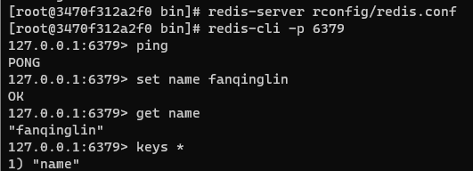
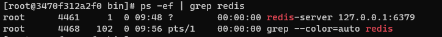

#### 图片

- 分布式文件系统 FastDFS
- 淘宝 TFS
- Google GFS
- Hadoop HDFS
- 阿里云 oss

```bash
docker run --name redis01 --rm -p 6666:6379 -d redis
docker exec -it redis bash
redis-cli -a 1qaz2wsx -p 6379
docker cp f:/redis/config/redis01.conf redis01:/data/redis.conf

```

# [`Redis`](https://redis.io/) [中文网](http://www.redis.cn/)

```bash
# 后台启动 redis.conf
daemonize yes
# 启动 /usr/local/bin 指定配置文件
redis-server rconfig/redis.conf
# 关闭
127.0.0.1:6379> shutdown
```

 



```bash
# 测试：100并发，十万请求
redis-benchmark -h localhost -p 6379 -c 100 -n 100000
```

```bash
[root@3470f312a2f0 bin]# redis-cli -p 6379
127.0.0.1:6379> select 3
OK
127.0.0.1:6379[3]> dbsize
(integer) 0

# FLUSHDB 清空当前数据库
# FLUSHALL 可以清楚全部数据库的内容
```

#### `Redis`[命令](http://www.redis.cn/commands.html)

#### `string`

```bash
127.0.0.1:6379> set views 0
OK
127.0.0.1:6379> INCR views
(integer) 1
127.0.0.1:6379> get views
"1"
127.0.0.1:6379> INCR views
(integer) 2
127.0.0.1:6379> get views
"2"
127.0.0.1:6379> decr views
(integer) 1
127.0.0.1:6379> get views
"1"
127.0.0.1:6379> incrby views 10
(integer) 11
127.0.0.1:6379> get views
"11"
127.0.0.1:6379> decrby views 3
(integer) 8
127.0.0.1:6379> get views
"8"
127.0.0.1:6379> mset user:1:name username user:1:age 20
OK
127.0.0.1:6379> mget user:1:name user:1:age
1) "username"
2) "20"
```

[`GETRANGE`](http://www.redis.cn/commands/getrange.html),[`SETRANGE`](http://www.redis.cn/commands/setrange.html),[`MSET`](http://www.redis.cn/commands/mset.html),[`MGET`](http://www.redis.cn/commands/mget.html),[`SETNX`](http://www.redis.cn/commands/setnx.html),[`MSETNX`](http://www.redis.cn/commands/msetnx.html):具有原子性操作

[`GETSET`](http://www.redis.cn/commands/getset.html)

#### `List`

```bash
127.0.0.1:6379> lpush list one
(integer) 1
127.0.0.1:6379> lrange list 0 -1
1) "one"
127.0.0.1:6379> rpush list right
127.0.0.1:6379> lpop list
"one"
127.0.0.1:6379> rpop list
"right"
```

[`LINDEX`](http://www.redis.cn/commands/lindex.html)

[`LLEN`](http://www.redis.cn/commands/lindex.html)

[`LREM`](http://www.redis.cn/commands/lrem.html)

[`LTRIM`](http://www.redis.cn/commands/ltrim.html)

[`RPOPLPUSH`](http://www.redis.cn/commands/rpoplpush.html)

[`LSET`](http://www.redis.cn/commands/lset.html)

[`LINSERT`](http://www.redis.cn/commands/linsert.html)

#### `SET`

`set`中值不能重复

[`SADD`](http://www.redis.cn/commands/sadd.html)

[`SMEMBERS`](http://www.redis.cn/commands/smembers.html)

[`SISMEMBER`](http://www.redis.cn/commands/sismember.html)

[`SCARD`](http://www.redis.cn/commands/scard.html)

[`SREM`](http://www.redis.cn/commands/srem.html)

[`SRANDMEMBER`](http://www.redis.cn/commands/srandmember.html)

[`SPOP`](http://www.redis.cn/commands/spop.html)

[`SMOVE`](http://www.redis.cn/commands/smove.html)

[`SINTER`](http://www.redis.cn/commands/sinter.html)

[`SDIFF`](http://www.redis.cn/commands/sdiff.html)

[`SUNION`](http://www.redis.cn/commands/sunion.html)

#### `Hash`

[`HSET`](http://www.redis.cn/commands/hset.html)

[`HGET`](http://www.redis.cn/commands/hget.html)

[`HMSET`](http://www.redis.cn/commands/hmset.html)

[`HMGET`](http://www.redis.cn/commands/hmget.html)

[`HGETALL`](http://www.redis.cn/commands/hgetall.html)

[`HDEL`](http://www.redis.cn/commands/hdel.html)

[`HVALS`](http://www.redis.cn/commands/hvals.html)

[`HINCRBY`](http://www.redis.cn/commands/hincrby.html) 没有`hdecrby`

#### `ZSET`(有序集合)

```bash
127.0.0.1:6379> zadd myset 1 one
(integer) 1
127.0.0.1:6379> zadd myset 2 two
(integer) 1
127.0.0.1:6379> zadd myset 3 three
(integer) 1
127.0.0.1:6379> ZRANGE myset 0 -1
1) "one"
2) "two"
3) "three"
```

[`ZRANGEBYSCORE`](http://www.redis.cn/commands/zrangebyscore.html)

[`ZREVRANGEBYLEX`](http://www.redis.cn/commands/zrevrangebylex.html)

#### `geospatial`[地理位置](https://www.redis.net.cn/order/3686.html)

底层其实是zset，可以使用zset的命令进行一些操作

#### [`Hyper/haɪpə(r)/loglog`](https://www.redis.net.cn/order/3629.html)

```bash
127.0.0.1:6379> PFADD key1 a b c d e f g h i j
(integer) 1
127.0.0.1:6379> PFCOUNT key1
(integer) 10
127.0.0.1:6379> PFADD key2 a b c d e f g h i j
(integer) 1
127.0.0.1:6379> PFCOUNT key2
(integer) 10
127.0.0.1:6379> PFMERGE key3 key1 key2
OK
127.0.0.1:6379> PFCOUNT key3
(integer) 10
```

#### [`Bitmap`](https://www.redis.net.cn/order/3550.html)

[`BITCOUNT`](http://www.redis.cn/commands/bitcount.html)

### 事务

一组命令的集合，不保证原子性，没有隔离级别

一次性、顺序性、排他性

[`MULTI /ˈmʌlti/ `](http://www.redis.cn/commands/multi.html)开启事务

[`EXEC /ɪɡˈzek/`](http://www.redis.cn/commands/exec.html)执行事务

[`DISCARD`](http://www.redis.cn/commands/discard.html) 放弃事务

`Jedis `可以进行管道的操作

#### 锁

[`WATCH`](http://www.redis.cn/commands/watch.html)

[`UNWATCH`](http://www.redis.cn/commands/unwatch.html)

### 配置文件

```bash
# 部分配置文件
# include /path/to/local.conf
# include /path/to/other.conf

# 绑定IP
bind 127.0.0.1

# 保护模式
protected-mode yes

# 默认端口
port 6379

# 守护进程开启方式
daemonize yes

# 如果后台运行，就需要指定一个pid文件
pidfile /var/run/redis_6379.pid

# 日志级别
# debug (a lot of information, useful for development/testing)
# verbose (many rarely useful info, but not a mess like the debug level)
# notice (moderately verbose, what you want in production probably)
# warning (only very important / critical messages are logged)
loglevel notice

# 日志位置
logfile ""

# 默认数据库数量 16
databases 16

# 是否总是显示logo
always-show-logo yes
```

```bash
# 持久化规则 save ? 时间（秒）内 ? key 进行了修改
save 900 1
save 300 10
save 60 10000

# 持久化出错后是否继续工作
stop-writes-on-bgsave-error yes

# 是否压缩 rdb 文件
rdbcompression yes

# 保存 rdb 文件错误校验
rdbchecksum yes

# rdb 保存目录
dir ./

# 密码操作
127.0.0.1:6379> config get requirepass
1) "requirepass"
2) ""
127.0.0.1:6379> auth 123456

# 客户端最大连接数
# maxclients 10000

# 最大的内存容量
# maxmemory <bytes>

# 内存到达上限之后的处理策略
# 1、volatile-lru：只对设置了过期时间的key进行LRU（默认值） 
# 2、allkeys-lru ： 删除lru算法的key   
# 3、volatile-random：随机删除即将过期key   
# 4、allkeys-random：随机删除   
# 5、volatile-ttl ： 删除即将过期的   
# 6、noeviction ： 永不过期，返回错误
# maxmemory-policy noeviction

############################## APPEND ONLY MODE ###############################

# 默认不开启 aof，使用 rdb 持久化，大部分情况下 rdb 就够用了
appendonly no

# aof 文件
appendfilename "appendonly.aof"

# 每次修改
# 每秒同步一次
# 不执行sync
# appendfsync always
appendfsync everysec
# appendfsync no
```

### 持久化

> - save规则满足，触发 rdb
> - flushall，触发 rdb
> - 退出 redis 触发 rdb

```bash
127.0.0.1:6379> config get dir
1) "dir"
2) "/usr/local/bin"

# aof文件有问题，无法启动，可以使用 redis-check-aof 检测文件,可能会丢失数据
redis-check-aof --fix appendonly.aof
```

#### 订阅发布

```bash
# psubscribe pattern [pattern] 订阅
# pubsub subcommand [argument [argument]] 查看订阅、发布状态
# publish channel message 发送 message
# punsubscribe [pattern [pattern]] 退订
# subscribe channel [channel] 订阅
# unsubscribe channel [channel] 退订

# 订阅端
127.0.0.1:6379> SUBSCRIBE fanqinglin
Reading messages... (press Ctrl-C to quit)
1) "subscribe"
2) "fanqinglin"
3) (integer) 1
1) "message"
2) "fanqinglin"
3) "hello fan message"

# 发送端
127.0.0.1:6379> PUBLISH fanqinglin "hello fan message"
(integer) 1
```

#### 主从复制

```bash
# 查看当前库的信息
127.0.0.1:6379> info replication
# Replication
role:master # 角色
connected_slaves:0 # 从机
master_replid:4c434c94911042206dacc8aea6ea4ccc7ad24e2b
master_replid2:0000000000000000000000000000000000000000
master_repl_offset:0
second_repl_offset:-1
repl_backlog_active:0
repl_backlog_size:1048576
repl_backlog_first_byte_offset:0
repl_backlog_histlen:0

# 配置文件配置
replicaof <masterip> <masterport>
bind 0.0.0.0

# master IP
docker inspect --format='{{range .NetworkSettings.Networks}}{{.IPAddress}}{{end}}' redisMaster
# 链接主机
127.0.0.1:6379> SLAVEOF 172.19.0.3 6379
OK
127.0.0.1:6379> info replication
# Replication
role:slave
master_host:172.19.0.3
master_port:6379
master_link_status:down
master_last_io_seconds_ago:-1
master_sync_in_progress:0
slave_repl_offset:0
master_link_down_since_seconds:1600777207
slave_priority:100
slave_read_only:1
connected_slaves:0
master_replid:d9a7e2117757ed5b121deb285a7df248de5aa2bc
master_replid2:0000000000000000000000000000000000000000
master_repl_offset:0
second_repl_offset:-1
repl_backlog_active:0
repl_backlog_size:1048576
repl_backlog_first_byte_offset:0
repl_backlog_histlen:0
```

master断开，redis只有读操作，没有了写操作

cmd添加的slave断了之后不会重新连接到主机

全量复制、增量复制

#### [哨兵](http://www.redis.cn/topics/sentinel.html)模式`sentinel /ˈsentɪnl/`

```bash
# 哨兵配置文件 sentinel.conf 可以在安装包中找到
# sentinel monitor 被监控的名称 host port 最后一个quorum的意思是有几台 Sentinel发现有问题，就会发生故障转移
sentinel monitor redis_sentinel 172.21.0.2 6379 1
# 启动哨兵
redis-sentinel sentinel.conf

# 主机重新启动，只能成为 slave
```

##### `sentinel.conf`详解

```bash
# 哨兵默认使用端口
port 26379
# sentinel monitor <master-name> <ip> <redis-port> <quorum>
sentinel monitor mymaster 127.0.0.1 6379 2
# 默认延时操作
# Default is 30 seconds.
sentinel down-after-milliseconds mymaster 30000
```

#### 集群

```bash
# 1.Redis 集群是无中心的
# 2.Redis 集群有一个ping-pang机制
# 3.投票机制，Redis集群节点数量必须是2n + 1
# 4.Redis 集群中默认分配了16384个hash槽，在存储数据时，就会将key进行crc16的算法，并且对16384取余，根据最终的结果，key-value会存放在不同的Redis节点中
# 5.每个节点都至少有一个从节点
# 6.单独针对Redis集群某个节点搭建主从
# 7.半数节点宕机，集群瘫痪

# 开启集群
cluster-enabled yes
# 集群节点配置
cluster-config-file nodes-6379.conf
# 对外IP
# * cluster-announce-ip
# 对外端口号
# * cluster-announce-port
# 总线端口号
# * cluster-announce-bus-port

redis-cli --cluster create nodeip:port [,nodeip:port [,nodeip:port...]] --cluster-replicas 1
```

##### `Redis`删除策略

> 1.定期删除，100ms查看3个key。
> 
> 2.惰性删除

> 缓存穿透：查不到。解决： 布隆过滤器，缓存空对象
> 
> 缓存击穿：过期段内大量请求。解决：永不过期，加分布式锁
> 
> 缓存雪崩：缓存集体失效、redis宕机。
> 
> 缓存倾斜：热点数据都在一台机器上。解决：扩展主从，redis之前设置cache